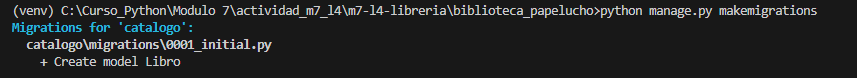
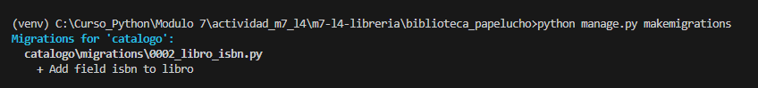
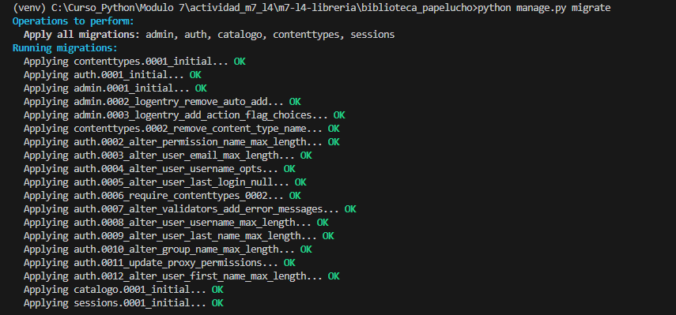
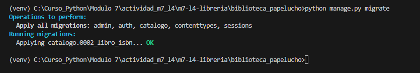
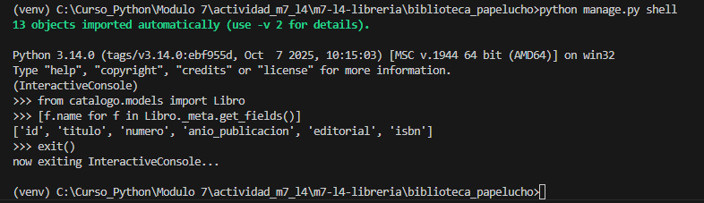
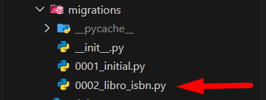
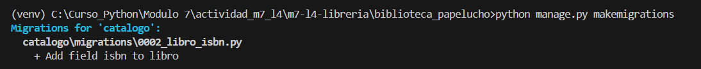
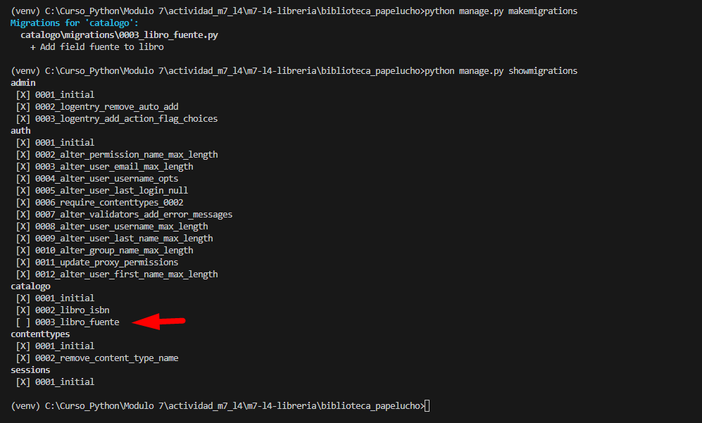
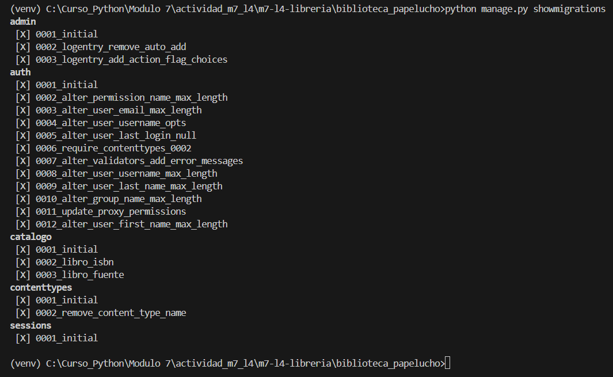

# Gestión de Migraciones en Django

* **Módulo:** Acceso a Datos en Aplicaciones Python-Django
* **Experiencia de Aprendizaje:** Actividad N°4 – Gestión de Migraciones en Django, Módulo 7
* **Autor:** Ximena Garrido

---

## 🎯 Objetivos de la Actividad

* Comprender qué son las migraciones en Django y qué problema resuelven.
* Crear y aplicar migraciones para reflejar cambios en los modelos.
* Utilizar comandos de Django para gestionar versiones del esquema de base de datos.

---

## 1️⃣ Comprensión Teórica

### ❓ ¿Qué es una migración en Django?

Una migración en Django es un mecanismo que permite **versionar y sincronizar los cambios realizados en los modelos** con la estructura real de la base de datos.

Actúa como un sistema de control de versiones del esquema de la base de datos, permitiendo aplicar o revertir cambios de forma controlada y segura.

---

### ❓ ¿Qué problema solucionan las migraciones respecto a los cambios en los modelos?

Las migraciones resuelven el problema de mantener **consistencia entre el código y la base de datos**.

Permiten:

* Agregar o eliminar campos
* Modificar tipos de datos
* Crear o borrar tablas

Todo esto sin necesidad de ejecutar sentencias SQL manualmente y sin comprometer la integridad de los datos.

---

### ❓ ¿Por qué no basta con modificar `models.py` sin hacer migraciones?

Modificar `models.py` únicamente cambia el código, pero **no modifica la estructura real de la base de datos**.

Si no se ejecutan migraciones:

* Django no actualiza las tablas
* Se generan errores al guardar o consultar datos
* La aplicación queda desincronizada respecto a la base de datos

---

## 2️⃣ Creación y Aplicación de Migraciones

### ✏️ Modificación del Modelo

Se agregó un nuevo campo `isbn` al modelo `Libro`:

```python
class Libro(models.Model):
    titulo = models.CharField(max_length=100)
    autor = models.CharField(max_length=50)
    isbn = models.CharField(max_length=13, null=True, blank=True)
```

Este nuevo campo permite almacenar el código ISBN del libro sin afectar registros existentes, ya que se configuró con `null=True` y `blank=True`.

---

## ▶️ Comandos Ejecutados

### 📌 Crear migraciones

```bash
python manage.py makemigrations
```

**Descripción:**
Detecta cambios en los modelos y genera el archivo de migración correspondiente dentro de la carpeta `migrations/`.

📷 **Evidencias:**





---

### 📌 Aplicar migraciones

```bash
python manage.py migrate
```

**Descripción:**
Aplica las migraciones pendientes y actualiza la estructura de la base de datos.

📷 **Evidencias:**





---

## 3️⃣ Verificación del Nuevo Campo

Se verificó que el campo `isbn` estuviera correctamente disponible en la base de datos mediante Django Shell y/o panel de administración.

📷 **Evidencia:**



---

## 4️⃣ Aplicación de Migraciones Existentes

### 🧪 Eliminación del Archivo de Migración (solo con fines pedagógicos)

Se eliminó manualmente la migración `0002` desde la carpeta:

```
catalogo/migrations/
```

Este procedimiento se realizó únicamente con fines académicos para observar el comportamiento de Django frente a la eliminación de un archivo de migración ya generado.

📷 **Evidencia:**



---

### ▶️ Regeneración de la Migración

Posteriormente se ejecutó:

```bash
python manage.py makemigrations
```

Django detectó nuevamente los cambios en el modelo y regeneró automáticamente el archivo de migración eliminado.

📷 **Evidencia:**



---

### ▶️ Aplicación de la Migración

Finalmente se ejecutó:

```bash
python manage.py migrate
```

Resultado mostrado por Django:

```
No migrations to apply.
```

Lo anterior indica que la base de datos ya se encontraba sincronizada con el estado actual de las migraciones registradas.

📷 **Evidencia:**


---

### ❗ ¿Qué sucede si no se aplica una migración pendiente?

Para comprobarlo:

* Se agregó un nuevo campo `fuente` al modelo.
* Se ejecutó `makemigrations`.
* No se ejecutó `migrate`.

Consecuencias observadas:

* Django detecta inconsistencias
* Se generan errores al interactuar con el modelo
* La base de datos queda desactualizada respecto al código

📷 **Evidencia:**



---

## 5️⃣ Revisión del Estado de Migraciones (Opcional)

### ▶️ Comando Ejecutado

```bash
python manage.py showmigrations
```

Este comando muestra:

* Las migraciones existentes
* Cuáles están aplicadas `[X]`
* Cuáles están pendientes `[ ]`

Permite verificar el estado actual del historial de migraciones del proyecto.

📷 **Evidencia:**



---

**Proyecto académico desarrollado con fines educativos.**